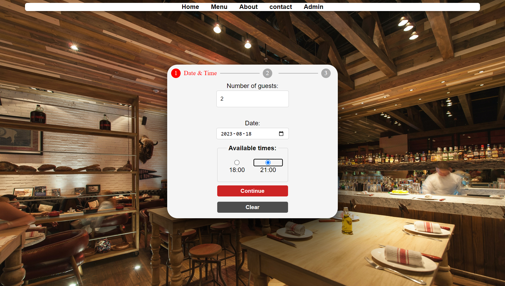
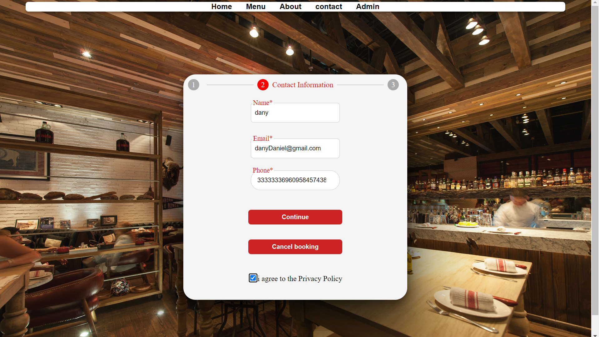
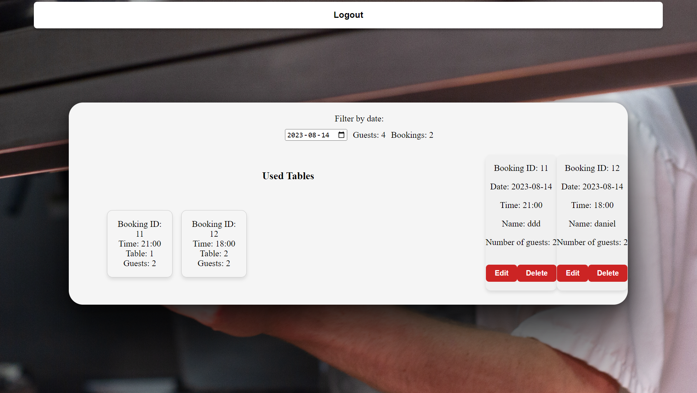
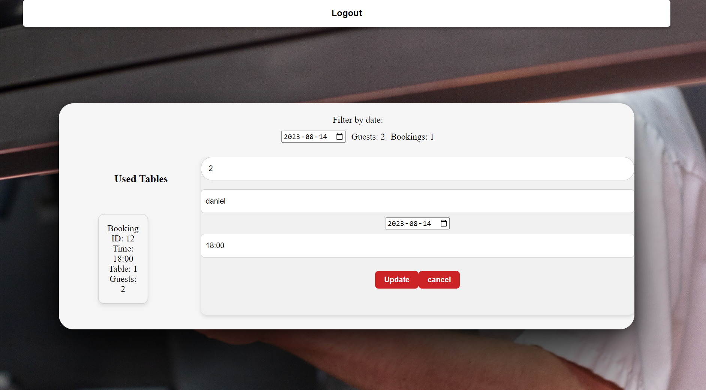

## Restaurant DApp
Welcome to our Restaurant DApp! This decentralized application enables users to book a table at our restaurant, leveraging the power of blockchain. The user-friendly interface and administrative controls ensure a seamless booking experience for customers and efficient management for restaurant staff.

## Setup and Deployment with Ganache
This DApp is designed for deployment using Ganache, a personal Ethereum blockchain for development purposes. To set it up:

1. Install Ganache:
If you haven't installed Ganache yet, download and install it from Ganache's official website.

2. Deploy the Contract:
Launch Ganache and set up a workspace.
Using your preferred development environment or tools like Truffle, deploy the contract.

3. Extract ABI and Contract Address:
Post-deployment, you will need the ABI and the contract address. These are typically found in the JSON file generated by the compilation of your smart contract. This file is often located in a directory named build/contracts or similar.
Open this JSON file, and you will find the ABI array and the contract address.

4. Update config.js with ABI and Contract Address:
Navigate to the Restaurant DApp's directory and open the config.js file (or the respective configuration file if named differently).
Locate the placeholders meant to store the restaurant's contract ABI and address.
Replace the existing ABI array and address with the new ABI and the address of the deployed contract from the JSON file.
Save and close the file.

>**Note**: Make sure to update both the ABI and contract address accurately to ensure that your DApp can interact with the contract on the Ganache network correctly.

1. Run the DApp:
With the ABI and contract address updated in config.js, you can now run the Restaurant DApp locally. It will interact with the Ganache blockchain.
For a detailed deployment procedure and contract interactions, refer to the documentation or review the setup process used in the Todo DApp with Ganache.
## Features
3-Step Booking Process: A clear, three-phase booking process ensuring precision and ease.
Admin Interface: Comprehensive controls for the restaurant staff to manage bookings.
GDPR Compliant: All user details and bookings align with GDPR regulations.
How to Use
Customers
1. 3-Step Booking Process
Step 1: Time & Date Selection

Navigate to the Booking Page.

* Select the number of guests and desired date.

If tables are available, choose your preferred timing (either 18:00 or 21:00).

Step 2: Personal Information

After selecting the time and date, proceed to enter your personal details, including:

Name
Email
Phone number

Step 3: Confirmation & Ticket View

Review your booking details.

Confirm your reservation.

Upon successful confirmation, you'll be presented with a ticket detailing your booking.

## Admin
1. Viewing Bookings
Navigate to the Admin Page to view all bookings.

Here, you'll see a comprehensive list of all bookings, including customer details and timings.

1. Managing Bookings
In the Admin Page, you have the option to:
Modify a booking: Update timing or customer details.
Remove a booking: Delete a reservation.
Add a new booking manually.

## Technical Details
Built using React with create-react-app.
Connects to a blockchain through specific services.
Utilizes a contract with functions to create the restaurant, manage bookings, and fetch bookings.
Ensures a consistent and intuitive design through a defined graphical profile.
Responsive design ensures usability across devices.
Development & Contributions
This project is hosted on GitHub. All team members' commits can be viewed in the repository.

Project management and task assignment were managed using Trello. Each task can be traced back to the responsible team member.

Feedback & Support
For feedback, suggestions, or issues, please reach out to us through our Contact Page.